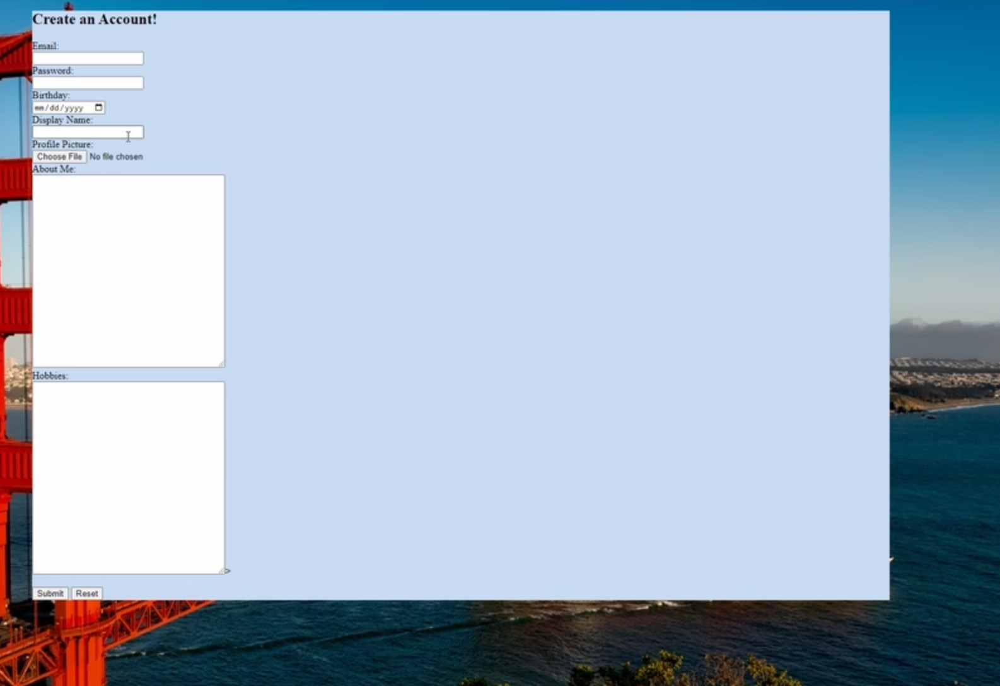
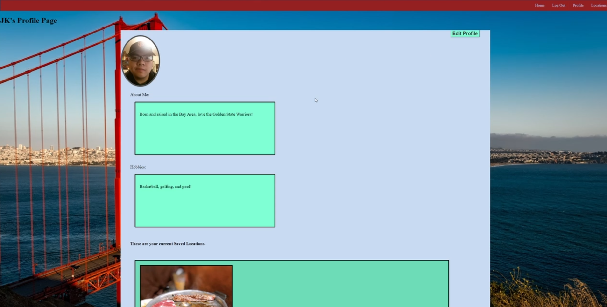
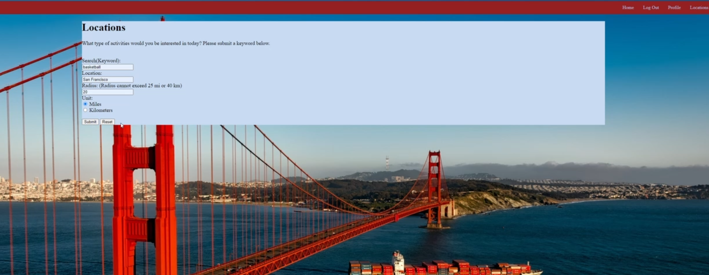
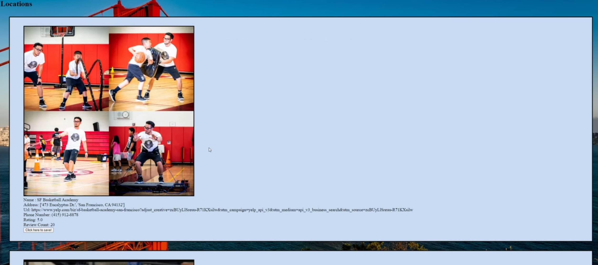
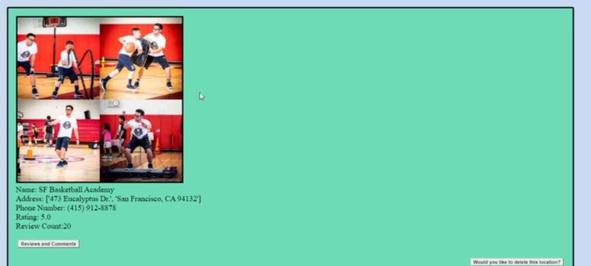
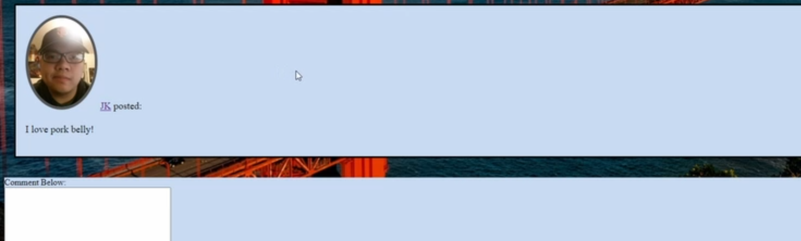

# Bestination

Learn more about the developer: www.linkedin.com/in/jkyi

Check out the demo here:  <a href="https://youtu.be/Z9hRPGeKdDQ?si=S6DjSL3302-8ov6S">Demo Reel.</a>

With its YELP inspired functionality, Bestination delivers an
application focused on providing the user with a wide variety of options 
to choose from, whether they be eating, hiking, skydiving, or even if the user
just wishes to have someone to talk to.

## Table of Contents
* [Technologies Used](#technologiesused)
* [How to run Bestinations](#run)
* [How to use Bestinations](#use)

## Technologies Used

* Python
* Flask
* PostgreSQL
* SQLAlchemy
* Javascript
* Jinja2
* HTML
* CSS
* Yelp API Search
* Yelp API Reviews
* Yelp API Business Details
* Cloudinary API

(dependencies are listed in requirements.txt)

##  How to run Bestinations

Bestinations has not been deployed, so here is how to run app locally on your machine.

### Run Bestinations Flask App

 * Set up and activate a python virtualenv and install all dependencies:
    * `pip install -r requirements.txt`
* Make sure you have PostgreSQL running. Create a new database in psql named capstone:
    * `psql`
    * `CREATE DATABASE capstone;`
* Create the tables in your database:
    * `python -i model.py`
    * While in interactive mode, create tables: `db.create_all()`
* Quit interactive mode. Now, we need to source our secrets.sh file for the YELP and Cloudinary API key.
    * As the secrets.sh file is not provided, the user will have to create get their own API key from YELP and Cloudinary before proceeding.
    * Secrets.sh will have 3 exports:
        * `export CLOUDINARY_KEY="Insert_API_here"`
        * `export CLOUDINARY_SECRET="Insert_SECRET_here"`
        * `export YELP_APIKEY="Insert_YELPAPI_here"`
    * Once done source secret.sh, seed the capstone.sql database, and start up the flask server:
        * `source.secrets.sh`
        * `psql capstone < capstone.sql`
        * `python server.py`
    * Go to localhost:5000 to see the web app.
            
##  How to use Bestinations

Start by navigating to the "Create Account" button and filling out the form.

Proceed to the "Profile" tab

The previous information you submitted is now displayed on the profile tab.

Proceed to the "Locations" tab and submit your query.

Your locations are now displayed, you may now save the location to view it on your profile.

Return to your profile and scroll down to see the saved locations. You are given the option to proceed to the reviews/comments or delete that location from your profile.

Proceed to reviews/comments to see existing reviews and comments. You may submit your own comment to see it on the page.
